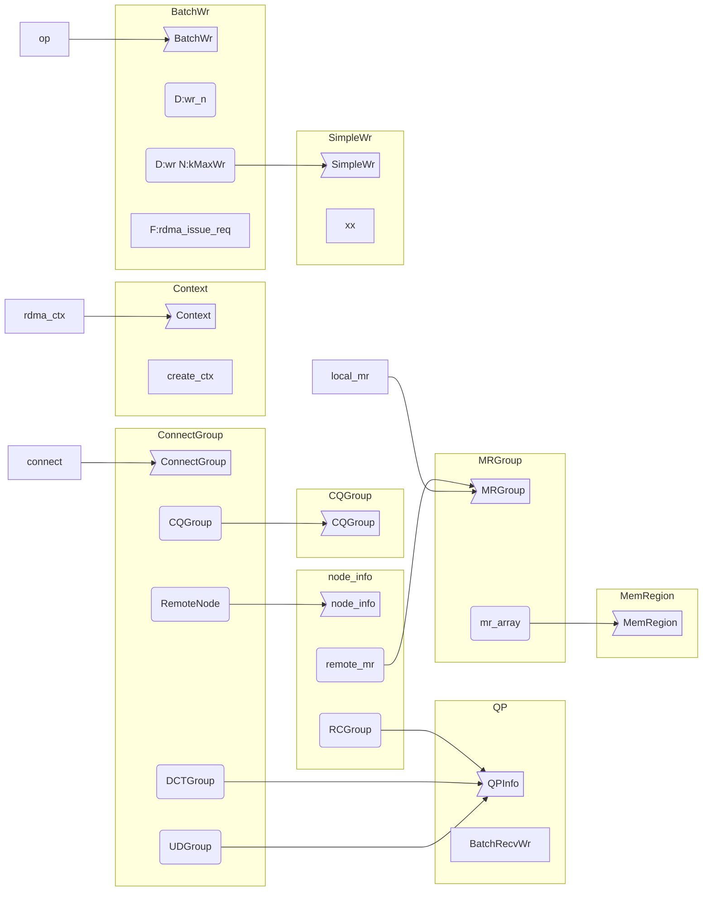

```mermaid
graph LR

    local_mr --> mrgroup_node
    rdma_ctx --> ctx_node
    op --> batchwr_node
    connect --> connectgroup_node
    
    subgraph Context
        ctx_node>Context]
        create_ctx
    end

    subgraph ConnectGroup
        connectgroup_node>ConnectGroup]
        cqgroup_mem(CQGroup)
        UD_mem(UDGroup)
        DCT_mem(DCTGroup)
        node_mem(RemoteNode)
    end
    cqgroup_mem --> cqgroup_node
    node_mem --> node_node
    UD_mem --> QPInfo
    DCT_mem --> QPInfo

    subgraph CQGroup
        cqgroup_node>CQGroup]
    end

    subgraph QP
        QPInfo>QPInfo]
        BatchRecvWr
    end


    subgraph node_info
        node_node>node_info]
        RC_mem(RCGroup)
        remote_mrg(remote_mr)
    end
    RC_mem --> QPInfo
    remote_mrg --> mrgroup_node


    subgraph MemRegion
        memregion_node>MemRegion]
    end

    subgraph MRGroup
        mrgroup_node>MRGroup]
        mr_arrays(mr_array)
    end
    mr_arrays --> memregion_node

    subgraph SimpleWr
        singlewr_node>SimpleWr]
        xx
    end
    subgraph BatchWr
        batchwr_node>BatchWr]
        wr_n(D:wr_n)
        wr(D:wr N:kMaxWr)
        F:rdma_issue_req
    end
    wr --> singlewr_node

```
